# 🏗️ ARCHITECTURE

Real-time **Collaborative Canvas** built with **Vanilla JS (Canvas API)** on the client and **Node.js + Socket.IO** on the server.  
This document explains the overall architecture, data flow, WebSocket protocol, undo/redo strategy, performance choices, and conflict resolution.

---

## 1) System Overview

**Key ideas**

- Client is split into **UI**, **Canvas**, **Main**, and **WebSocket** modules for separation of concerns.
- Server splits **transport (Socket.IO)**, **room/user management**, and **authoritative drawing state**.

---

## 2) Runtime Data Flow (Stroke Lifecycle)

```mermaid
sequenceDiagram
  participant C1 as Client A (Browser)
  participant S as Server (Socket.IO)
  participant C2 as Client B
  participant C3 as Client C

  Note over C1: User presses pointer → starts drawing

  C1->>C1: canvas.js fires onStrokeStart(startPoint)
  C1->>S: emit("stroke:start", strokeMeta + startPoint)
  S->>S: state.beginStroke(user, strokeMeta)
  S-->>C2: emit("stroke:start", op)
  S-->>C3: emit("stroke:start", op)

  loop While pointer moves
    C1->>C1: canvas.js drawSegment(local)
    C1->>S: emit("stroke:point", point)
    S->>S: state.appendPoint(user, point)
    S-->>C2: emit("stroke:point", op)
    S-->>C3: emit("stroke:point", op)
  end

  C1->>S: emit("stroke:end")
  S->>S: state.endStroke(user)
  S-->>C2: emit("stroke:end", op)
  S-->>C3: emit("stroke:end", op)
```

**Notes**

- The **server is authoritative** for stroke ordering and history.
- New users receive a **snapshot** (`room:init`) with full history.

---

## 3) WebSocket Protocol

### Events: Client → Server

| Event          | Payload                                              | Description                                          |
| -------------- | ---------------------------------------------------- | ---------------------------------------------------- |
| `join`         | `{ username, userId, roomId }`                       | Join/create a room; server responds with `room:init` |
| `cursor:move`  | `{ x, y, userId, color }`                            | Broadcast pointer indicator                          |
| `stroke:start` | `{ tool, color, width, brushStyle, userId, start? }` | Begin a stroke                                       |
| `stroke:point` | `{ point, userId }`                                  | Stream stroke points                                 |
| `stroke:end`   | `{ userId }`                                         | End stroke                                           |
| `history:undo` | `{}`                                                 | Request a global undo                                |
| `history:redo` | `{}`                                                 | Request a global redo                                |
| `ping:now`     | `{}`                                                 | Latency measurement                                  |

### Events: Server → Client

| Event              | Payload                                | Description                          |
| ------------------ | -------------------------------------- | ------------------------------------ |
| `room:init`        | `{ roomId, users, history, nextOpId }` | Initial room bootstrap               |
| `room:updateUsers` | `UserPublic[]`                         | Live user list update                |
| `cursor:move`      | `{ userId, x, y, color }`              | Remote cursor indicator              |
| `stroke:start`     | `Operation`                            | Start stroke op with server opId     |
| `stroke:point`     | `Operation`                            | Stroke op with appended point        |
| `stroke:end`       | `Operation`                            | End stroke op                        |
| `history:replace`  | `{ history, nextOpId }`                | Replace full history after undo/redo |
| `ping:now`         | `{}`                                   | Latency ping                         |

---

## 4) Undo/Redo Strategy (Server-Authoritative)

**Algorithm**

- **History** holds a sequence of immutable operations (`opId`, `userId`, meta, points).
- On `undo`: pop the last **non-erased** op → mark as erased or remove → push to **redoStack** → broadcast `history:replace`.
- On `redo`: pop from redoStack → append back to history → broadcast `history:replace`.

**Why server-side?**

- Ensures consistent global state across all clients.
- Avoids divergence caused by local undos.

---

## 5) Conflict Resolution

**Problem**: When many users draw concurrently, events can interleave or canvas paints can overwrite.

**Strategy**

1. **Server ordering** – All stroke events are sequenced server-side (optionally via a per-room queue) to maintain consistent op order.
2. **Idempotent ops** – Each op carries an `opId`; clients can safely replay without duplication.
3. **Layered rendering (optional)** – Render each user’s strokes on a separate layer to avoid overwrites.
4. **Global replay** – After undo/redo, server sends `history:replace` so clients re-render from the authoritative log.

---

## 6) Performance Considerations

- **Throttle pointer events** (~8ms) to reduce network spam while keeping smooth drawing.
- Use **`requestAnimationFrame`** for rendering to prevent layout thrash.
- Consider **delta compression** of points for lower bandwidth.
- Offload **cursor rendering** to absolutely-positioned DOM elements for GPU-accelerated transforms.

---

## 7) Room & Presence Model

---

## 8) Security & Failure Handling

- **Room isolation** – Events are scoped with `io.to(roomId)`; users receive only their room’s updates.
- **Validation** – Server checks membership on every stroke/undo/redo.
- **Reconnection** – Clients auto-reconnect; on reconnect, server re-sends `room:init`.
- **Back-pressure** – Throttling on client prevents overloading server during rapid pointer events.

---

## 9) Design Rationale

- **Separation of concerns**: canvas rendering, orchestration, transport, state, and rooms are isolated.
- **Server authority** prevents divergence and simplifies undo/redo, persistence.
- **Event-driven** design scales horizontally by room.
- **Extensible**: easy to add shapes, text tools, or persistence.

---
